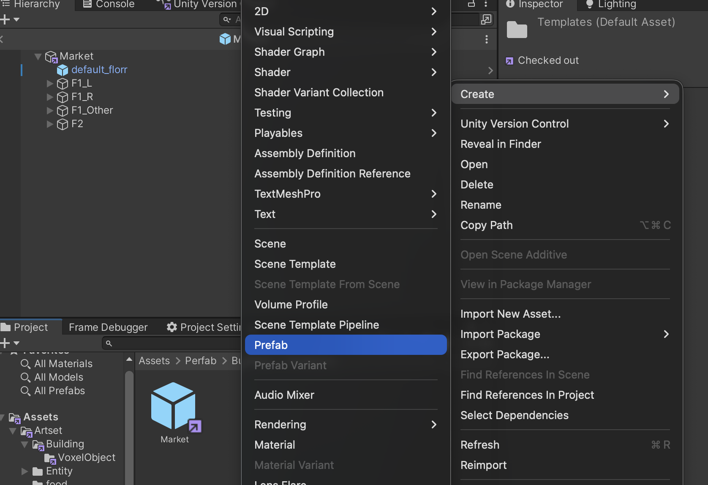
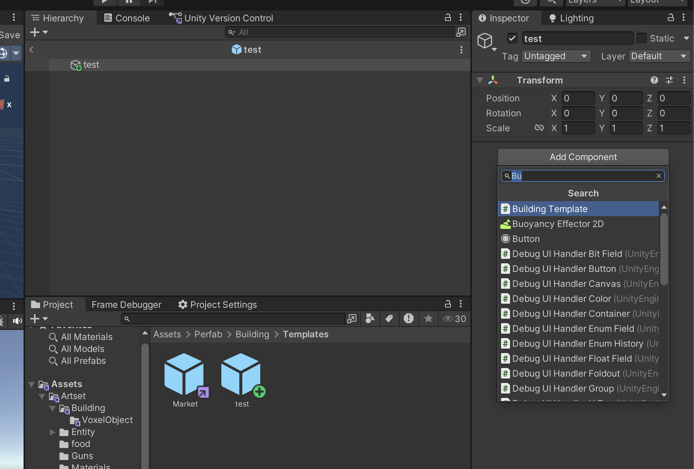
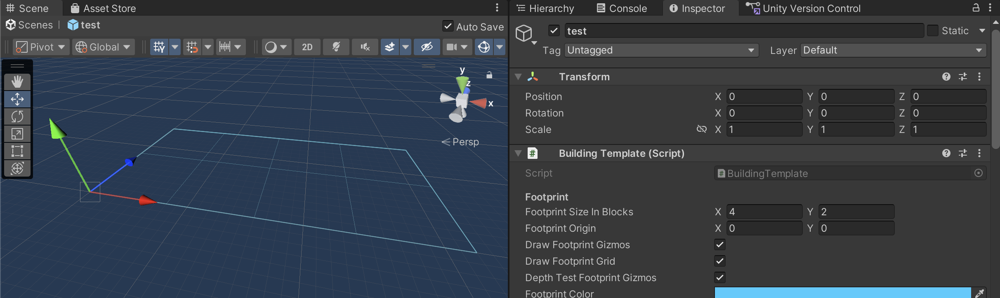
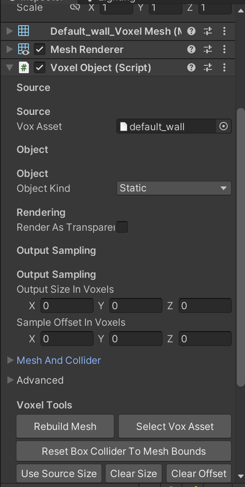
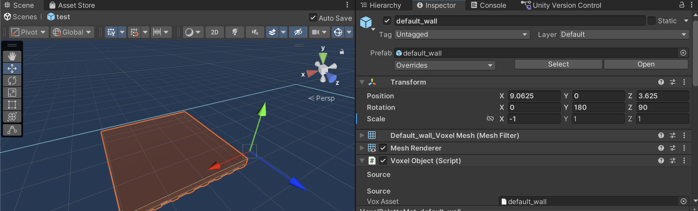
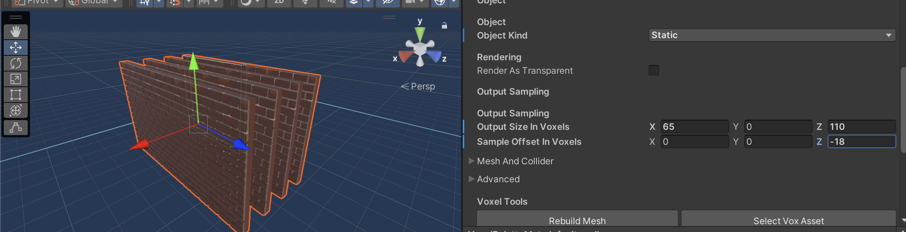
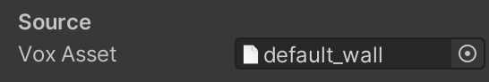
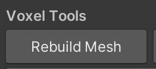

## 前置知识：

理解Unity编辑器的基本交互，理解prefab与脚本逻辑

## 简单入门

简单来说，地图编辑器的职责是快速产出地图建筑模板用于后续地图生成时直接取用

而地图模板的基本单位是“区块”，以 $8 \times 8$ Unity 单位为长宽的平面区域，而一 Unity 单位等于十六体素大小

请善用 Unity 编辑器功能，如有必要可以配合自定义脚本快速编辑

## 地图模板

要创建新地图模板，请在 `Assets/Perfab/Building/Templates/` 目录下新建 prefab ，并为该预制体添加 `Building Template` 脚本

请务必记得通过 `Footprint Size` 参数配置该建筑模板的大小，这将决定模板会以怎样的方式生成

接下来只需在蓝框范围内随意编辑你想要的建筑即可，不限定形式

## 体素对象

为了保持风格统一，或是方便您的编辑，我们提供了一套简便的体素资产管线

您可以在 `Assets/Perfab/Building/VoxelObject/` 下找到前人已经使用过的资产，直接拖入当前 prefab 中即可

### 操作

为方便您的使用，我们提供了相当多方便编辑的工具

当您尝试拖动该对象时，会发现我们为您提供了体素吸附功能，旨在方便您的对齐操作

rotation 支持各方向的九十倍度数旋转，以及Scale支持输入 -1 以代表各方向翻转

如果当前的 Voxel Object 存在任意透明部分，请勾选 `Render As Transparent` 选项

`Output Size In Voxels` 选项可以辅助您朝任意方向延伸，其会自动循环采样以方便您朝各方向拉伸或缩小，通过修改 `Sample Offset In Voxels` 可以修改采样的起始位置，以便您更好的处理循环的部分

您可以通过 `Reset Box Collider` 键快速生成碰撞箱，然而有时其不尽准确，您也可以手动配置碰撞箱

### 创作体素资产

如果您并不满足于已有的资产，可以绘制并添加新的资产至库中

我们推荐使用 [Magica Voxel](https://ephtracy.github.io/) 软件进行创作以适配我们的管线

我们支持您通过修改 Magica Voxel 的材质属性来实现更好的光照效果，直接导入 `.vox` 文件到 `Assets/Artset/Building/VoxelObject/` 下即可

要创建新的 Voxel Object 的 prefab，您只需要在上述的 `Assets/Perfab/Building/VoxelObject/` 文件夹中新建 prefab，添加 `Voxel Object` 脚本并将 Vox Asset 替换为您的 .vox 文件即可

如果您在多个建筑模板中使用了同一个 prefab，但又对其材质进行了一定的修改，只需要对该 prefab 单击 `Rebuild Mesh` 键即可自动应用到所有的 prefab 上

最后，祝您使用顺利