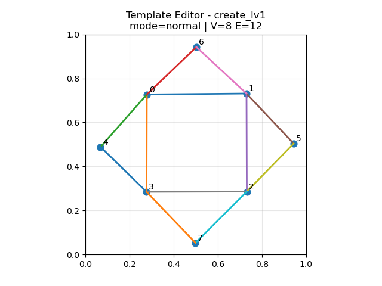

# 制造法阵

## 标准模版

## 条件

魔力消耗：无
原材料供应：对应制造物品

## 用途

类似于工作台，交互后会产生一个交互面板，可以选中并制造 [曾经解析](./解析法阵.md) 过的物品，并使用选中的粉末配比去制造，不同的材料比例会产生不同方法的 [材料特性](../材料特性.md)

## 进阶技巧

当遇到需要复杂组装或是需求量巨大的物品时，不妨试试 [复制法阵](./复制法阵)
