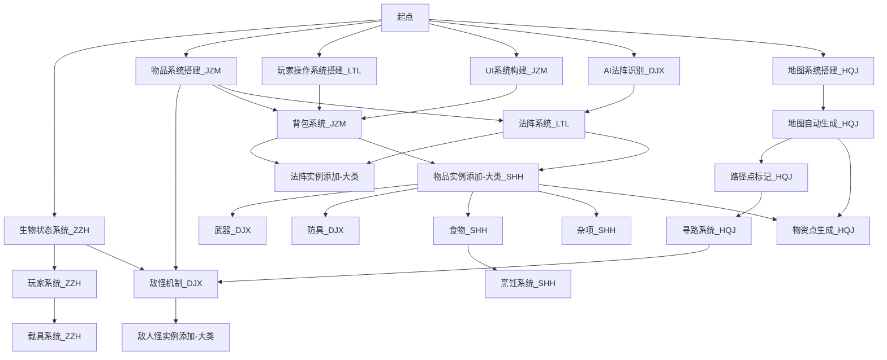

```mermaid
flowchart TD
    A --> M[生物状态系统_ZZH]
    A --> D[物品系统搭建_JZM]
    A --> F[玩家操作系统搭建_LTL]
    A[起点] --> B[UI系统构建_JZM]
    A --> C[AI法阵识别_DJX]
    A --> E[地图系统搭建_HQJ]

    M --> N[玩家系统_ZZH]

    D --> K
    B --> G[背包系统_JZM]
    D --> G
    F --> G

    E --> H[地图自动生成_HQJ]
    H --> I[路径点标记_HQJ]
    I --> J[寻路系统_HQJ]
    J --> K[敌怪机制_DJX]
    
    M --> K

    C --> L[法阵系统_LTL]
    D --> L

    N --> O[载具系统_ZZH]
    L --> P[法阵实例添加-大类]
    G --> P
    G --> Q[物品实例添加-大类_SHH]
    L --> Q
    Q --> R[武器_DJX]
    Q --> S[防具_DJX]
    Q --> T[食物_SHH]
    Q --> U[杂项_SHH]

    T --> V[烹饪系统_SHH]

    K --> W[敌人怪实例添加-大类]
    H --> X[物资点生成_HQJ]
    Q --> X


    
```